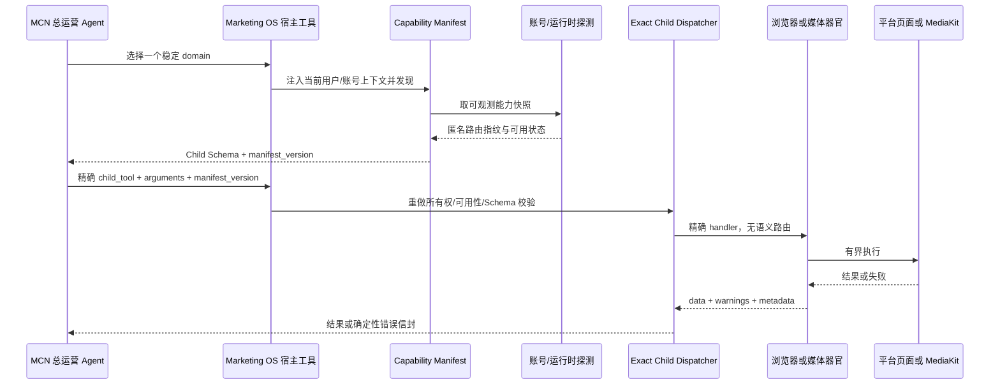

# A19 MCP Manifest、Child 调度与 Apache Ossie 审计

## 结论

用户图片与 Apache Doris MCP Server 1.0.0 的请求生命周期一致，不是只有概念的架构图。上游已实现稳定领域工具、按需披露的精确子能力、路由级能力快照、`manifest_version`、调用前再授权与再发现、输入/输出 Schema 校验和确定性错误信封。其 1.0.0 发布页记录的源标签提交为 `953c3b6c...6471`，许可证为 Apache-2.0。

这套机制适合第五版的浏览器、MediaKit、粉丝画像 provider 和桌面执行器等“能力器官”，但不应成为营销策略、评分、路线或发布决策引擎。第五版采用其合同思想，不引入 Doris Server 本身，不复制 SQL、Doris 探针、RBAC 或路由管理代码。

Apache Ossie 是数据集、字段、关系、维度和指标的 JSON/YAML 语义交换规范，不是 MCP 调度器。当前核心规范为 `0.2.0.dev0` 草案，项目处于 Apache 孵化期。第五版只吸收“一个指标只有一份可版本化定义”的原则，暂不引入 `apache-ossie` 依赖或把 `ai_context` 当成 Agent 提示词。

## 图与源码核对

| 图中环节 | Doris 1.0.0 实现证据 | 第五版决定 |
| --- | --- | --- |
| `tools/list` 只返回稳定领域 | 8 个 domain、55 个 child | 采用小而稳定的器官 domain，不机械复制“8” |
| 空调用发现 Child Manifest | `DomainManifestService` | 采用；内部浏览器由宿主额外注入不可见 capability token |
| 路由级能力快照 | `DorisCapabilityDetector` | 改为账号租约、平台、CLI Schema/provider 世代等可观测事实 |
| `manifest_version` | 合同、授权 Child、能力世代的确定性哈希 | 采用；账号匿名路由指纹也进入哈希 |
| 再授权 + 再发现 | `DomainDispatcher` | 采用；发现不是执行授权 |
| 精确 Child Binding | 一个 child 对应一个 handler | 采用；禁止 MCP Server 内部用模型或模糊匹配选工具 |
| 只读 SQL/HTTP Guard | Doris 专属边界 | 拒绝迁移；各器官使用自己的客观 Guard |
| `data/warnings/metadata` | 统一结果和输出 Schema | 采用；异常原文和密钥不返回 |

## 第五版请求链

## 与第四版的分界

- Manifest 只陈述“现在能不能安全调用”，不评价选题、定位或脚本好不好。
- Dispatcher 只接受精确名称，不猜测用户意图，不修改模型输出，不强制工具路线。
- 不可逆发布、费用、所有权和幂等依然由领域服务硬校验；营销建议不进硬门。
- 发现步骤是工具合同加载，不是第二个 Agent，也不增加固定访谈或思考轮数。

## Apache Ossie 采用边界

| 候选 | 决定 | 原因 |
| --- | --- | --- |
| 指标名、定义、来源、粒度、时间窗口、维度和关系 | 吸收概念 | 防止六平台同名 KPI 含义漂移 |
| `apache-ossie` Python 包 | 暂不引入 | `0.2.0.dev0` 草案且孵化中，当前业务还没有跨 BI 交换需求 |
| Ossie `ai_context` | 只作审查后的语义证据 | 不得成为 SOUL、模型覆写或流程硬门 |
| 完整语义编译/查询层 | 拒绝 | 不为尚未出现的问题引入第二数据真相源 |

## 证据限制

终端在本次审计时无法解析 `github.com`，因此没有将外部仓库克隆进工作区；源码核对来自 GitHub 官方标签、发布页与 raw 文件。Doris 1.0.0 发布页的上游测试数据只是上游报告，不当作第五版本地实测。

## 迁移决定

已在第五版原创实现 `CapabilityDispatcher`，并将内部浏览器 MCP 从裸 `observe` 工具改为 `marketing_browser -> discover/call` 合同。直接采用稳定 domain、精确 Child、路由指纹、版本化 Manifest、双 Schema 校验、错误脱敏和调用前重校验；拒绝引入 Doris 代码、平铺 55 工具、SQL Guard、动态模型路由、直接 Ossie 依赖或 MCP SDK 2.x 即时升级。
