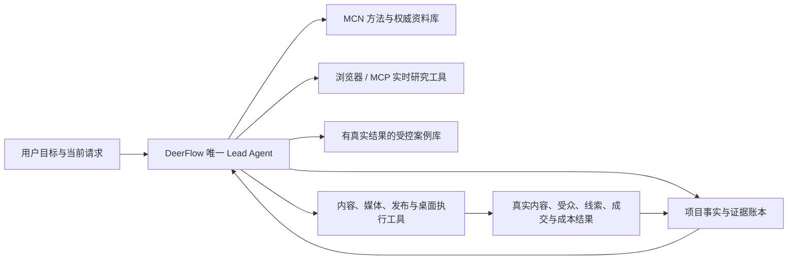

# A25 标准 Agent 与外挂知识层审计

## 结论

第五版需要外挂知识层，但不需要先建一个把所有资料混在一起的向量数据库，也不需要再造 Agent 运行时。

标准生产 Agent 的共同骨架是：模型负责动态判断，指令声明职责和边界，数据工具提供可核验上下文，动作工具执行现实操作，记忆与业务状态跨轮次保存，权限限制高风险动作，追踪和评测证明整个系统是否完成业务结果。OpenAI 将最小 Agent 概括为模型、工具和指令；Anthropic 将基础单元概括为增加检索、工具和记忆的增强型 LLM。Google 的生产架构进一步区分知识库、工作记忆和耐久业务台账。

因此第五版应继续使用 DeerFlow 的唯一 Lead Agent 和 LangGraph 循环。需要新增的是孵化领域的知识、证据、状态和评测，不是第二个营销 Agent。

## 刚才实验实际证明了什么

`micro-bakeoff-20260810T152051Z` 的四个候选都未通过业务评审，但它只是直接调用同一 chat model 的单轮上下文实验：

- 没有给候选任何检索、浏览器、项目状态或案例工具。
- 没有执行真实 DeerFlow Agent 循环、追踪工具选择或观察环境结果。
- 运行时评测使用 `mcn_incubation.context.LEAD_AGENT_CONSTITUTION`，生产使用 `lead_agent.prompt.SYSTEM_PROMPT_TEMPLATE`；两份孵化宪法已经发生强弱漂移。审计后已提取 `INCUBATION_AGENT_CONTRACT` 作为唯一来源，并用回归测试固定。
- 所谓“事实账本”候选只额外重复了两个资产事实，不等于可查询、可版本化、覆盖目标/限制/决策/结果的真实项目状态。

所以该实验可以否定“换核心提示词就够了”，也再次证明第四版固定硬流程会诱发填空式编造；它不能否定增强型单 Agent，也不能为完整知识架构选出胜者。

## 第五版目标架构

这些连接都是工具或数据合同，不是固定工作流。Lead Agent 根据当前问题决定读什么、研究什么和执行什么；知识层不能替它选择人设、定位、表现形式或变现路线。

## 四种知识必须分开

### 1. MCN 方法库

保存定位、受众问题、信任建立、表现形式、内容发动机、变现、转化和实验设计等可复用方法。它属于程序性知识，只告诉 Agent 可以从哪些角度判断，不提供项目事实，也不保证某个方法适用于当前主体。

当前十张方法卡已覆盖整体孵化、定位、受众、可信证明、表现形式、对标转译、内容发动机、变现、转化和实验。它们已有类型化来源与 12 条检索基线，但仍不足以代表一个 MCN 公司的完整孵化知识。后续应继续从已审计旧版、权威研究和真实运营结果蒸馏版本化单元。

### 2. 项目事实与证据库

这是每个主体的业务真相源，保存用户确认事实、原始素材、产品证明、限制、平台资产、决策版本、未知、实验和真实结果。它必须结构化、按用户和项目隔离、可追溯、可版本化；不能依赖向量相似度决定什么是真相，也不能由普通聊天记忆覆盖。

“配方可公开”只能支持配方透明这一事实，不能自动支持安全、无残留、除油效果或适用材质。每个可核验主张需要指向证据 ID；没有证据时保持未知。

### 3. 外部参考与实时证据库

保存官方平台规则、公开研究、市场观察和对标采集。每项都要记录来源、采集时间、适用平台/地区、有效期、原文证据和限制。易变化的平台信息优先通过可见浏览器或 MCP 实时采集，快照进入证据库；不能把搜索摘要直接升级为项目事实。

### 4. 受控案例库

只收录已经执行并产生真实结果、经过人工复核的孵化案例。案例要记录条件、方案、替代方案、结果、限制、失败原因和状态，同时返回支持案例与反例。当前没有这类案例，因此第五候选继续关闭。

## 检索决定

- 首版使用显式元数据过滤加关键词/BM25。DeerFlow 已有中文可选分词和 SQLite FTS5/BM25 检索底座，可以复用设计与测试经验。
- 不把 DeerMem 当作项目事实库。DeerMem 适合用户偏好和跨会话记忆，其内容由记忆提取流程生成，权威性、项目版本和业务对象边界不同。
- 不默认把整库塞进系统提示词。Anthropic 的上下文工程指出上下文是有限注意力预算；Agent 应即时取回最小高信号证据。
- 当语料规模和同义表达使关键词检索漏召回时，再用检索评测比较 BM25、embedding、混合检索和 reranking。Anthropic 的检索实验支持混合精确匹配与语义检索，但也要求按具体语料评测。
- 检索结果必须返回稳定 ID、类别、来源、时间、适用条件、支持主张、限制和精简原文；相似度分数不是事实置信度。

## 标准开发流程

1. **发现**：定义用户、业务结果、风险和非目标，确认问题确实需要 Agent。
2. **评测先行**：从真实任务和旧版失败建立能力集与回归集，先写人工可判定的参考答案或验收口径。
3. **最小增强型 Agent**：用最强可用模型、一个 Lead Agent、薄指令和少量清晰工具建立基线。
4. **按失败补能力**：缺知识加检索，缺事实加项目账本，缺现实观察加浏览器/MCP，缺计算加确定性工具；不把每次失败都写成提示词规则。
5. **端到端追踪**：记录实际上下文、检索结果、工具调用、状态变化、成本、延迟和最终环境结果。
6. **分层评测**：分别测检索召回、事实支持、工具选择、最终孵化质量、不可逆操作和结果修正；模型裁判由人工专家校准。
7. **真人试点**：个人、品牌、产品各做一个真实闭环，发布和费用继续人工确认。
8. **运营迭代**：用真实结果、用户反馈、A/B 测试和定期人工抽检更新方法和案例。

Microsoft 将 Agent 生命周期概括为发现、实验、构建、部署和持续运营，并强调实验应使用真实数据。Anthropic 建议早期从约 20-50 个真实任务开始评测，结合代码、模型和人工评分，阅读完整轨迹，并把能力评测与回归评测分开。第五版目前处于第 2 与第 3 步之间，不能跳到大规模前端或自动发布。

## DeerFlow 已有与真实缺口

| 能力 | DeerFlow 现状 | 第五版决定 |
| --- | --- | --- |
| Agent 循环与恢复 | LangGraph Lead Agent、检查点、运行恢复已存在 | 直接复用 |
| 工具与 MCP | 内建工具、延迟发现、MCP、浏览器和沙箱已存在 | 直接复用并收窄权限 |
| 工作记忆 | 对话、检查点、总结已存在 | 直接复用 |
| 通用长期记忆 | DeerMem、FTS5/BM25 和作用域隔离已存在 | 只保存偏好与一般上下文 |
| 孵化方法 | 十张方法卡、类型化来源与 12 条检索基线已测试 | 按失败用例扩充语料和检索难例 |
| 项目业务真相 | 数据合同、V2 仓储、宿主启动建表和 Owner 隔离事实/证据只读工具已测试 | 建设受控采集写入和当前决策投影 |
| 外部证据 | 来源、快照时间、哈希、范围、局限、争议和过期合同已测试 | 接入浏览器/MCP 采集与刷新回执 |
| 真实案例 | 只有合同，无合格案例 | 真实闭环后再开启 |
| Agent 评测 | 目前真实调用主要是单轮输出 | 改为生产 Lead Agent 加工具的端到端评测 |

## 第五版决定

- 建设外挂知识层，但先做本地、版本化、类型隔离的知识服务，不先引入向量数据库。
- 内部项目真相优先作为 DeerFlow 内建工具接入；浏览器、平台和可独立部署的数据源可通过 MCP 接入。是否使用 MCP 是部署边界，不决定回答质量。
- 生产与评测的孵化宪法现已统一；随后接入项目事实读取和来源化知识检索，再重跑小样本完整 Agent 评测。
- 继续保持一个 Lead Agent。知识检索、事实核验、粉丝画像、内容生产和浏览器操作都不拥有最终孵化判断权。

## 首条实现回执（2026-08-11）

- `IncubationRepository.list_current_truths` 只返回一个 Owner/项目内未被替代的事实头；完整旧记录继续追加保存。
- 内建 `incubation_project_context` 从已认证 `ToolRuntime` 取得用户身份，模型参数中没有 `owner_id`，返回时也不泄露 Owner 标识。
- 每条结果保留 `kind`、稳定 ID、来源、证据引用和时间，未知与创意假设不会被扁平化成事实。
- Gateway 使用现有数据库连接启动独立 incubation metadata；禁用耐久数据库时工具明确报告不可用，不用 DeerMem 或聊天内容伪装业务真相。
- 该纵切只证明项目事实读取与隔离合同成立，尚未证明来源化方法检索或最终孵化质量提升。

## 第二条实现回执（2026-08-11）

- A26 已把十张方法卡连接到八条类型化已复核来源，并以 12 条检索题固定有界关键词基线。
- `EvidenceItem` 与独立 schema V2 保存项目级来源快照、哈希、观察、局限、平台/地区范围、争议和有效期；旧记录使用替代链而非原地覆盖。
- 内建 `incubation_project_evidence` 只从认证运行上下文取得 Owner，只读返回当前证据，并提示 contested 与 refresh due；它与 `incubation_project_context` 分开，证据不会自动升级为事实。
- 该纵切仍未接浏览器/MCP 写面，也未通过完整 Agent 或真实经营闭环验证，因此 ADR-007 保持 `proposed`。
