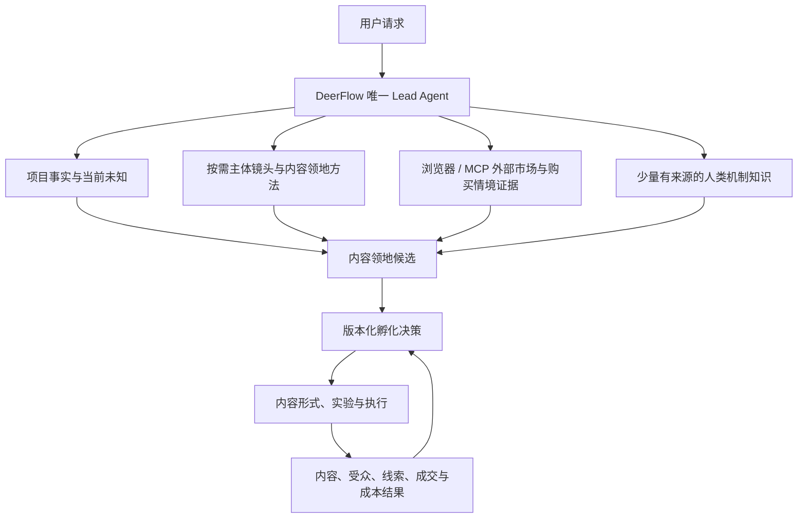

# A41 跨行业营销脑学科与落地架构

## 结论

第五版不能为黄金礼品、水果店、果农、宝妈等行业分别写一份答案库。大量用户真正要求的是一个**跨主体、跨行业、但受项目事实约束的营销推理系统**：同一套稳定内核理解“谁在经营、卖什么、人在什么处境下需要它、主体凭什么拥有这片内容、观众为什么会把能力归因给它”，再按人物、商品、场所、生产源头和组织等不同事实组合出不同路线。

它不是某一门学科，也不是一段神提示词。可行架构是七类知识和工程能力的合成：营销科学定义品牌应关联哪些购买情境；消费者行为解释人为什么选择；认知语义学把表面名词还原成事件；人类学和社会学提供关系、仪式与社会实践；内容与叙事方法把领地变成持续题材；设计方法负责发散和收敛；Agent 工程负责按需上下文、事实隔离、版本、记忆和评测。

代码上不写 `if industry == "水果"`，也不做“行业 -> 唯一内容领地”的分类器。第五版只需要在现有 `IncubationDecisionVersion` 中增加一个很薄的 `TerritoryCandidate` 列表及选中引用，保留候选推演和修改原因；现有 Lead Agent、项目事实、证据、方法检索、案例记忆和 JSON 版本仓储继续复用。该候选先进入离线架构竞赛，当前不接生产运行时。

## 涉及哪些学科

| 学科 | 对营销脑的职责 | 不能让它做什么 |
| --- | --- | --- |
| 营销科学与品牌管理 | 用 Category Entry Points 描述人在什么动机、情绪、时间、地点和购买任务下进入品类；检验内容是否让品牌在真实购买情境中更容易被想起 | 不能把一个品类的常见购买情境直接宣布为某客户的事实，也不能用播放量代替品牌心智与成交 |
| 消费者行为 | `Jobs to Be Done` 从属性进入功能、社会和情感进展；Means-End Chain/Laddering 从属性、后果连接到价值 | 不能把访谈方法变成固定问卷，也不能仅凭理论替用户编造动机 |
| 认知语义学 | Frame Semantics 把“礼品、水果、种植、照顾”等词放回事件框架，观察参与者、动作、条件、规则和后果 | 不能用语法中心词或自动语义解析器决定营销定位 |
| 人类学与社会学 | 提供互惠、仪式、身份、地位、家庭分工、地方生活、生产劳动、信任和禁忌等社会机制 | 不能把文化概括当成特定人群刻板印象，也不能证明某题材一定有流量 |
| 内容策略与叙事 | 把领地变成可重复的情境、问题、冲突、证明、观察和栏目；选择适合的故事、讲述、档案、过程或演示 | 不能先默认口播、短剧或三个内容支柱，再倒推主体适配 |
| 设计方法与创造力研究 | 先理解与重构问题，再产生不同答案、用小规模试验淘汰；Double Diamond 可作为发散/收敛旁证 | 不能变成四阶段流程门；Lead 可以按当前证据来回跳转 |
| 决策科学、实验与 Agent 工程 | 保存假设、替代方案、来源和真实结果；按需检索最小高信号上下文；用代码、模型和人工评分共同评测 | 不能用运行时分数替模型判断，也不能因相似案例自动复制旧结论 |

Case-Based Reasoning 对结果案例库有借鉴意义：检索过去案例、尝试复用、根据新问题修订并保留经验。但第五版只采用“带条件、结果、限制和反例的经验”思想，不采用最近邻即答案；跨用户案例默认关闭，成功案例也不能自动升级成规律。

## 什么是跨行业不变的内核

不变的不是答案，而是每个候选都必须能解释的商业连续性：

```text
运营主体、商业供给与经营目标彼此分开
  -> 当前事实能唤起哪些使用、交换、生产或关系事件
  -> 人在这些事件中想完成什么功能、社会或情感任务
  -> 哪些反复出现的处境会让人进入品类或需要这个主体
  -> 哪几片内容领地同时具有题材丰度和语义连续性
  -> 当前主体凭什么可信、持续、独特地拥有其中一片
  -> 内容如何建立识别与商业归因
  -> 观众在何种真实处境下回到咨询、购买或其他目标
  -> 用什么最小内容与经营信号修订判断
```

这是一组判断问题，不是必须依次执行的阶段。信息不足时可以保留多个候选，也可以只解决当前最有价值的一段。

## 哪些部分必须动态组合

一个客户通常同时具有多种事实镜头，Lead 可以组合，不必先把项目塞进唯一行业类型：

- **人物镜头**：跨时间经历、能力、欲望、关系、判断方式、证明和真实变化。宝妈、老板、师傅、果农等角色只改变资源、限制和接触面，不能吞掉这个人。
- **商品或服务镜头**：使用、选择、交换、替代、结果和风险。黄金礼品、单款耳塞、财务咨询都可从这里进入人的任务。
- **场所与零售镜头**：反复发生的到店、选品、问答、服务和地方生活。水果店、餐馆、母婴店常同时是内容现场和交易入口。
- **生产源头镜头**：时间、土地、天气、材料、工艺、判断、损耗和不确定性。果农与水果店都卖水果，但前者对“水果如何长成”拥有第一方证明。
- **组织与品牌镜头**：成员、规则、选择、标准、协作、历史和公共承诺。企业礼赠、合作社和连锁门店会比单个人多出组织可信度与交付问题。

这些是可按需检索的方法镜头，不是五个 Agent、五个状态或五张必填表。`SubjectKind` 继续只作粗粒度提示，不扩成几百个行业枚举。

## 三组案例为什么必须不同

### 水果店

同样说“卖水果”，社区门店若主要服务家庭复购、到店和即时配送，可能从成熟度判断、季节选择、家庭食用情境和本地信任中发散；若主要做企业礼盒，重点会转向礼赠节点、预算、收礼关系、体面与履约。两个方向都与水果有关，但内容领地、购买情境、证明和转化入口不同。

水果店能否讲“从土地到餐桌”，取决于它是否真有产地访问、供应链证据和持续素材；没有就不能借用果农身份。

### 果农

面向消费者直卖且能长期记录果园的果农，可能拥有生长周期、天气选择、采摘时机、损耗和产地信任；面向批发采购的合作社则更可能围绕分级、供期、批次稳定、风险沟通和履约证明建立影响。二者不能因为都叫果农就共用一个“乡村治愈”模板。

### 宝妈

“宝妈”没有自动对应的品类行为。做过十年会计的人可以把母亲身份当时间和隐私限制，账号核心仍可能是小生意财务判断；长期管理一家五口而没有既有服务的人，则可以探索有限资源下的家庭协作与生活系统，但变现必须先验证。阶段角色不能替代能力、欲望、证明和付费问题。

`marketing-territory-contrast-cases.jsonl` 把这六个对照冻结为待专家复核案例。它不保存标准答案，只要求同表面标签在事实、目标或新证据变化后产生实质不同的领地、形式、证明或变现判断。

## Agent 架构怎么落



箭头表示信息依赖，不是固定工作流。Lead 可以先给暂定候选，再研究购买情境；也可以在用户只要求脚本时直接从已批准领地进入内容。外部研究员以后可以作为只读工具帮助搜集情境与反例，但不能选择领地。

## 知识怎么分层

1. **程序性方法卡**：告诉 Lead 如何区分主体、供给、事件、任务、领地、归因和实验。它不包含行业答案。
2. **通用机制卡**：保存互惠、身份、仪式、信任、风险、照顾、地方性、时间与生产等有来源的短知识和限制。首版只取少量，不能成为万能人性词典。
3. **项目事实和证据**：客户私有的能力、产品、客户、利润、素材、限制、成交与外部观察，是选择路线的主要依据。
4. **平台与市场快照**：搜索、评论、对标和平台观察只说明当时可见现象，带来源、时间和局限。
5. **结果案例与反例**：只有真实执行、产生结果并经人工复核后进入；检索必须返回条件和失效原因。

Anthropic 的上下文工程支持在有限注意力预算中即时取回最小高信号材料，并反对把全部边界案例塞进核心提示词。第五版沿用现有 `incubation_context`，优先扩充其来源化内容，不再增加一个功能重叠的“营销脑工具”。

## 领域代码怎么写

当前 `IncubationDecisionVersion` 已经版本化并通过 JSON payload 持久化，但只保存最终 `content_engine` 字符串。最小改动是在它内部保存候选，而不是新建运行时、工作流或行业表：

```python
@dataclass(frozen=True, slots=True)
class TerritoryCandidate:
    territory_id: str
    statement: str
    lens_refs: tuple[str, ...]
    semantic_bridge: tuple[str, ...]
    recurring_situations: tuple[str, ...]
    ownership_basis: tuple[str, ...]
    attribution_path: str | None
    truth_ids: tuple[str, ...] = ()
    evidence_refs: tuple[str, ...] = ()
    unknowns: tuple[str, ...] = ()


class IncubationDecisionVersion:
    # Existing fields remain backward compatible.
    territory_candidates: tuple[TerritoryCandidate, ...] = ()
    selected_territory_id: str | None = None
```

`semantic_bridge` 保存可读推演，例如“黄金修饰 -> 礼品 -> 送/收 -> 关系表达”，而不是固定的中心词、动作、价值、故事等几十个字段。`recurring_situations` 证明它能持续生内容；`ownership_basis` 解释当前主体凭什么能讲；`attribution_path` 解释怎样回到账号与生意。缺失进入 `unknowns`，不会阻止 Agent 继续。

Python 只执行结构可靠性：ID 唯一、选中项确实存在、引用属于当前 Owner/项目、版本追加、幂等和向后兼容。Python 不解析中心词、不计算语义距离、不给领地打运行时总分，也不自动把候选改写成最终答案。

首轮代码改动应局限于：

- `domain.py`：增加上述轻量候选并扩展现有决策对象。
- `persistence.py`：对候选做向后兼容的 JSON 序列化；不新增数据库表。
- `methods.py`：只在离线对照胜出后加入一张 `content_territory` 方法卡。
- `knowledge.py`：登记经复核来源；通用机制知识先用少量版本化卡片，不建知识图谱。
- `evaluation.py` 或独立小模块：加载对照案例、保存多次输出和人工评分；语义质量由校准后的模型与 MCN 人工共同判断。
- `incubation_context`：复用同一工具返回按需卡片；不改 Lead 核心提示词，不强制调用。

## 如何服务大量不同用户

- 每个用户和项目的事实、证据、候选与结果继续 Owner 隔离；任何客户案例默认不能被另一客户检索。
- 共享层只保存公开理论、经许可的匿名方法和人工复核后的可迁移结论，不保存客户原文、素材或商业秘密。
- 公共网页证据可按 URL、时间和内容哈希缓存，客户推断与决策不能跨项目缓存。
- 每次候选保存模型、方法版本、来源和输入哈希；模型升级后用固定对照集重跑，而不是凭感觉切换。
- 服务规模增长先扩评测与来源治理，再考虑 BM25、embedding、微调或专业子 Agent。只有结果证明现有检索或模型能力不足才升级。

开源项目已经大量覆盖品牌资料、SEO、内容生成、分发和分析，但 A36 尚未找到能直接迁入的跨主体孵化判断内核。第五版不再寻找一个整包替代品；只吸收来源、评测、上下文和执行层的成熟做法。

## 评测怎么证明不是模板

评测必须同时包含：

- **同标签异事实**：水果店 A/B、果农 A/B、宝妈 A/B 应产生实质不同判断。
- **异标签同机制**：黄金礼赠和水果礼盒都可能触及礼赠，但主体证明、产品属性、受众情境和商业回路不能被复制。
- **新证据修订**：客户结构、镜头能力、交付方式或真实结果变化后，旧领地能被保留、收窄、替换或停止，并记录原因。
- **多次一致性**：开放题既看 `pass@k` 是否能提出好候选，也看 `pass^k` 是否持续守住事实、归因和不套模板的底线。
- **结果闭环**：最终以内容供给、受众归因、合格线索、成交、成本和长期信号修订，不用单次文本漂亮程度宣布成功。

代码检查只负责字段、引用、隐私和版本。领地深度、差异和商业连续性使用有反例的模型 rubric，并频繁与 MCN 人工判断校准；黄金礼品仍是唯一用户确认锚点，水果与宝妈对照目前不能算标准答案。

## 实施顺序

1. 复核并补足跨商品、人物、门店、服务和组织的对照案例，至少建立一小批人工锚点与反例。
2. 用当前生产 Lead 形成无新增方法的基线，多次运行并保存完整上下文、输出、Token 和人工评审。
3. 在隔离评测配置中加入 `TerritoryCandidate` 结构和一张方法卡，比较是否提高业务质量而非只让答案更整齐。
4. 再比较少量人类机制卡和购买情境研究；只有检索显著提高结果才进入默认库。
5. 胜出后才扩展生产决策对象与持久化，并在右侧界面完成水果店、果农、宝妈和黄金礼品真实会话。
6. 真实发布、结果回收和复盘后，首批案例才进入受控案例记忆。

## 第五版决定

1. 跨行业营销脑采用“稳定商业连续性内核 + 可组合主体镜头 + 项目事实与证据 + 版本化领地候选”，拒绝行业模板路由。
2. 一个项目可同时使用人物、商品、场所、生产源头和组织镜头；不把它们做成并列 Agent 或固定阶段。
3. 最小代码对象为嵌入现有 `IncubationDecisionVersion` 的 `TerritoryCandidate`；不新增数据库表、第二运行时或营销工作流。
4. 当前不修改核心提示词，不接入生产方法库，不建立语义解析器、知识图谱、向量数据库、行业规则树或自动案例晋升。
5. 先用同标签异事实与新证据修订评测验证方法，再写领域和持久化代码；不能因黄金礼品一例成立就宣布通用。
6. 水果店、果农和宝妈的六个对照案例状态均为待专家复核；没有真实用户、内容与经营结果前不得写成成功案例。
7. A41 只签署研究与候选架构，最终采用条件记录在 ADR-010，当前保持 `proposed`。
