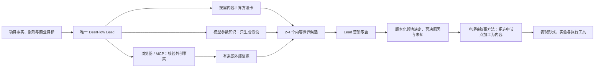

# A43 内容世界推演与查理课程对照审计

## 结论

用户的判断成立：当前缺口首先是**引导模型调用已有知识进行有方向的内容世界探索**，不是给模型再灌一套行业答案。四种方向应被设计成一组可选认知算子：向上抽象、向下拆分、横向展开和跨维连接。它们帮助模型发现候选，不决定最终营销路线，也不是固定四步流程。

首选候选不是关键词路由，也不是向量知识库。第五版应先用一张短、版本化、可按需读取的方法卡说明四种算子与防跑偏边界；Lead 自主决定是否调用和如何组合。模型的参数知识负责生成创意假设，项目事实负责主体适配，浏览器/MCP 负责把历史、文化、作品、产业和当前市场主张核成外部证据，唯一 Lead 负责营销取舍。

查理课程与这套方法有重要连接，但不能冒认来源。公开课程与书目能够支持“故事元素、人物、欲望与行动、复杂叙事、场景、悬念和冲突”等叙事加工方向；在本次公开材料、第四版文件与 Git 历史中，**未找到可靠原始来源**证明“向上、向下、横向、跨维”或“时间 × 空间 × 事件 × 人物 × 冲突”是查理老师给出的固定公式。四向扩展应标成**第五版综合**，查理方法只作为横向叙事和候选落地的课程来源之一。

## 指定会话说明了什么

会话 `019ff0ac-ebbf-7520-bae5-2b91f1c4da57` 的价值不在最后一段漂亮总结，而在连续纠偏：模型先把黄金礼品提炼成送礼与人情，又把这条成功路线机械迁移到水果；用户随后迫使它认识水果母世界、榴莲子世界、时间/空间/事件/人物/冲突，以及影视和游戏等跨维世界。

这条轨迹暴露三个不同问题：

1. **探索不足**：模型容易停在用途、购买技巧或一个常见表现形式。
2. **过度迁移**：模型会把前一案例的好答案当成下一行业的默认答案。
3. **收敛失控**：模型会把一个用于说明方法的子世界误当成最终定位。

所以记忆不能只保存最后结论。项目级决策历史要保存被否决候选及原因，例如“水果 -> 礼品”被否决是因为它无视水果自身的生产、品类、季节和文化世界；榴莲被否决为唯一答案，是因为它只是向下拆分的例子。这里保存的是用户可见纠正与决定，不保存模型隐藏思维过程。

## 第四版查理 Skill 溯源

### 没有独立的同名 Skill

第四版没有一个名为“查理编剧”的独立 Skill 目录。相关内容分散在：

- `distill-screen-methods`：课程地图、来源等级和跨来源机制卡。
- `engineer-desire-behavior`：欲望、目标、行动、反馈、策略变化和状态改变。
- `run-cinematic-curriculum`：把查理、Sciamma、Kaufman、Gilroy 等体系放在同一训练课程中，并保留冲突。
- `write-ip-episode`：将查理公开课程目录作为中文商业叙事练习索引。

Git 追溯只找到提交 `27e48e10` 将整套电影化方法栈一次加入。该提交同时增加 129 个文件、约九千行内容；它能证明第四版当时做了大规模综合，不能证明此前存在一份独立、逐课转录的“查理 Skill”。

### 第四版本身已经标了综合性质

第四版 `creator-mechanism-cards.md` 把“欲望必须变成行动”标为 `cross_source_synthesis`；“起承转合是策略变化轨迹”更明确标为 `analyst_inference`，来源同时含查理、Celine Sciamma 和 Tony Gilroy。其证据规范还写明：课程目录只能识别知识范围，不能替代正文；没有对应课文时不能自行定义专有模型。

这条规范应保留。第五版可以吸收机制，不能把跨来源综合改写成查理课程原话，更不能把第四版整套电影化编排迁回孵化内核。

## 网络对照

### 能确认的课程范围

- Bilibili 公开合集显示课程包含故事要素、人物、复杂叙事等大量单元。
- 蜻蜓 FM 的“复杂叙事”节目简介明确涉及多元角色、非线性视角、人物弧与多主角电影。
- 查理 2025 年《写好短剧》的公开目录包含故事构建类型、丰富故事元素、人物、四幕结构、场景、叙事视角与创作公式。
- 晋中信息学院对曹小林讲座的记录包含起承转合、商业电影节拍、爱情/喜剧、短视频需求，以及“建立期待、放大期待、转折、兑现”的叙事链；记录同时强调想象、整合与审美不能被 AI 替代。

这些来源共同支持把查理体系用于“把候选世界变成人物、事件、目标、阻力和变化”的叙事加工。但公开目录和活动摘要都不等于完整课程正文；现阶段不能把未见到的具体公式写成课程事实。

### 四向扩展的相邻理论

| 扩展方向 | 主要学科支撑 | 在第五版中的作用 |
| --- | --- | --- |
| 向上抽象 | 品类认知、认知语义学、消费者任务、文化与交换研究 | 从商品名进入品类行为、人类任务、关系与仪式，但保留语义桥和商业归因 |
| 向下拆分 | 分类学、产品/产业知识、世界构建 | 将过大的母世界拆为可持续观察的子世界，不把 SKU 列表当内容发动机 |
| 横向展开 | 叙事学、编剧、情境认知、冲突设计 | 沿时间、空间、事件、人物与冲突寻找可反复发生的故事节点 |
| 跨维连接 | 类比推理、概念整合、互文性、跨媒介世界构建 | 在现实、历史、神话、影视、游戏和未来间寻找结构连接，不做表面蹭题 |

Henry Jenkins 对跨媒介叙事的讨论提供了相邻证据：复杂世界可以容纳多个人物和故事，扩展也可以补人物、世界与事件之间的空白。但第五版的“跨维连接”范围更宽，不等同于严格的跨媒介叙事；它还包含现实与历史、产业与神话之间的类比，因此只引用为邻近理论。

## 提示词、关键词还是向量库

### 核心提示词

不把四种算子、五个横向维度和所有例子塞进 Lead 核心提示词。核心提示词只保留身份、孵化目标、事实边界、决策权和不可逆操作限制。若离线对照胜出，最多增加一句高层能力提醒，例如“需要发现长期内容领地时，可按需读取内容世界探索方法”，不写固定路线。

Anthropic 的上下文工程建议把上下文视为有限注意力资源，追求最小、高信号的材料，并通过观察到的失败逐步增加说明。这与第五版“薄宪法 + 按需方法”一致。

### 关键词

关键词可以帮助找到一张已知方法卡，但**不使用关键词决定**扩展方向、内容领地或营销结论。`水果` 不能自动触发“向下”，`礼品` 不能自动触发“向上”，`游戏` 也不能自动触发“跨维”。算子选择需要结合主体、目标、资源、受众与当前候选质量由模型判断。

当前只有一张很短的四向方法候选时，最稳妥的读取方式是明确方法 ID 或 Lead 自主浏览方法目录，根本不需要语义检索。现有关键词/BM25 可继续服务较大的方法库发现，但召回命中不等于方法被正确使用，A42 已经证明这一点。

### 向量知识库

本轮**不引入向量数据库**。四种算子本身只有少量稳定文本，放进向量库不会增加推理能力，反而增加切块、召回、版本、过期与可解释性成本。项目事实也必须继续使用类型化精确读取，不能依赖相似度决定事实。

只有未来方法、案例和资料规模扩大，并且离线检索评测证明当前目录/BM25漏召回影响最终业务判断时，才测试 embedding。届时也应比较 BM25、embedding 与混合检索；Anthropic 的公开实验显示 embedding 与 BM25 的组合优于仅 embedding，且仍需上下文化切块、重排和任务评测。向量不是默认答案。

### 模型已有知识怎么用

模型的参数知识适合做广泛联想：它可以提出某种历史礼仪、产地故事、影视意象或游戏机制作为创意假设。但参数知识不是可核验来源，尤其可能过时或记错作品细节。

因此候选输出要区分：

- `project_fact`：来自当前主体事实账本。
- `external_evidence`：经浏览器/MCP 核验并保留来源、时间、范围和限制。
- `model_inference`：模型基于已有事实做出的可反驳解释。
- `creative_hypothesis`：为了扩展世界提出、尚未核实的连接。
- `unknown`：会改变选择但当前没有答案的事项。

参数知识负责打开门，外部证据负责确认门后是不是真的有路。

## 候选架构

### 第一层：内容世界探索

评测专用方法卡 `content-world-exploration-v1` 只提供四个可选算子和边界，不提供行业答案。Lead 或一个有界只读 explorer 可生成少量候选；两者都不得写项目状态、选最终路线或直接面向用户。是否使用 explorer 仍由 Lead 决定，A42 的两遍法尚未胜出，所以当前只形成设计，不注册生产工具。

自然语言探索先于结构保存。A42 已证明，要求模型直接填完整 JSON 会诱导其补造字段。候选稳定后才可映射到现有 `TerritoryCandidate`，并允许大部分字段为空。

每个候选至少说明：

- 使用了哪些算子，以及从主体到世界的 `semantic_bridge`。
- 可继续展开的母世界、子世界或时间/空间/事件/人物/冲突节点。
- 哪些是事实、外部证据、推断、创意假设和未知。
- 主体能否持续接触、观察、证明或参与该世界。
- 对受众有什么价值，怎样自然回到业务。
- 最强反例、不成立条件和内容漂移风险。

这些是候选质量观察项，不是模型必填硬门，也不能由确定性代码评分后拒绝回答。

### 第二层：营销取舍

四向扩展只负责扩大搜索空间。唯一 Lead 再根据主体适配、题材供给、信任形成、受众价值、商业归因、成本和关键未知进行取舍。向上并不比向下高级，跨维也不比现实更有创意；最远连接若不能回到主体，就应被否决。

### 第三层：叙事加工

查理方法位于选定内容节点之后或候选验证期间，用人物、欲望、行动、事件、问题、障碍、结果、场景和叙事视角把节点变成可看的内容。它负责**叙事加工**，不拥有**营销取舍**。这允许第五版按需吸收编剧工艺，同时继续排除电影化 IP 产品、导演工作台和整套电影生产流程。

## 检索分层决定

| 信息层 | 当前读取方式 | 为什么 |
| --- | --- | --- |
| 四向方法卡 | 明确方法 ID / 小目录直接读取 | 内容短、稳定、需要完整呈现，不需要向量召回 |
| 项目事实与决定 | 现有类型化账本精确读取 | 事实、Owner、版本和替代关系不能由相似度决定 |
| 外部历史/作品/产业事实 | 浏览器或 MCP 即时研究 | 需要来源、日期、适用范围与版权边界 |
| 扩大的方法库 | 元数据过滤 + 关键词/BM25 基线 | 可解释、已有能力、先以检索难例评测 |
| 未来真实案例记忆 | 仅限人工复核结果；支持例与反例共同检索 | 不让漂亮创意或失败建议自动晋升经验 |
| 未来大语料 | 仅在评测胜出后测试混合检索与重排 | embedding 解决召回问题，不解决营销判断问题 |

## 下一轮架构竞赛

在任何生产接线或新付费调用前，先扩充离线/人工锚点并比较：

1. 薄基线，不提供四向方法。
2. 一张短方法卡，四种算子均为可选。
3. 强制四步/五维矩阵，作为预期失败对照。
4. 短方法卡加即时外部研究，但只在候选包含可核实主张时调用。
5. 短方法卡加有界只读 explorer，验证额外调用是否带来稳定增益。

评分看最终业务判断，不看固定工具轨迹：候选是否真正不同、语义桥是否成立、是否保留主体与商业连续性、是否补造事实、是否能提出反例、是否记住纠正并随新证据修改。黄金礼品和水果会话先作为专家纠偏锚点，再补个人、品牌、单品、服务和组织案例；未经真实结果复核，不写入成功案例记忆。

## 第五版决定

1. 将四种方向记录为第五版“内容世界扩展算子”候选，不称为查理课程固定公式。
2. 查理相关内容只蒸馏叙事工艺，保留课程来源、第四版综合和第五版综合三种证据身份。
3. 首个单遍候选是一张短、版本化的方法卡；A44 已将该用法业务拒绝。下一候选改为评测专用纯探索模式，仍不改核心提示词、不建立固定四步流程、不使用关键词决定算子或行业答案。
4. 本轮不引入向量数据库；参数知识只生成假设，历史、作品、文化、产业和当前主张通过浏览器/MCP形成外部证据。
5. 复用现有 `TerritoryCandidate`、项目事实与决策版本；保存候选、否决原因和修订，不新增表、阶段或语义评分门。
6. 内容世界探索、营销取舍和叙事加工分层；唯一 Lead 继续拥有孵化判断权，查理 Skill、方法卡或 explorer 都不能成为第二大脑。
7. conversation-v1/v2 内容世界文本目前只存在于审计、ADR 和评测代码中，不注册到 `methods.py`、`knowledge.py`、`incubation_context` 或 Lead 提示词。
8. ADR-011 保持 `proposed`；离线锚点、人工评审和真实结果未通过前，不宣称该架构最佳。

## 后续证据

A44 已执行 conversation-v1 单遍算子卡对照并判定业务失败；A45 确认该轮无记忆、Skill 或完整 DeerFlow 母提示词污染，主要客户端问题是纯探索与完整孵化交付的任务边界混杂。本审计的课程来源边界不变；新的 conversation-v2 只读探索卡仍是评测候选，不接生产。
